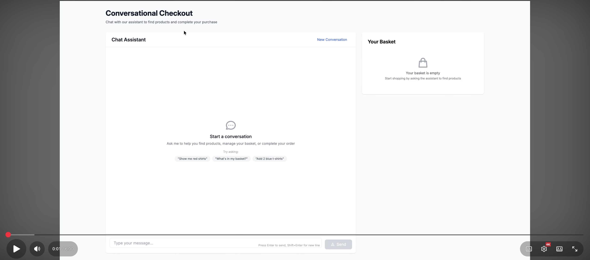
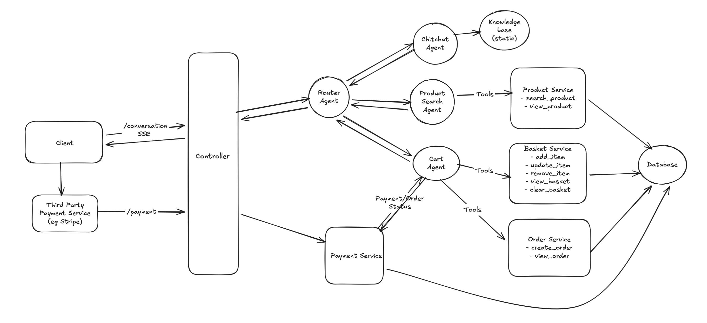
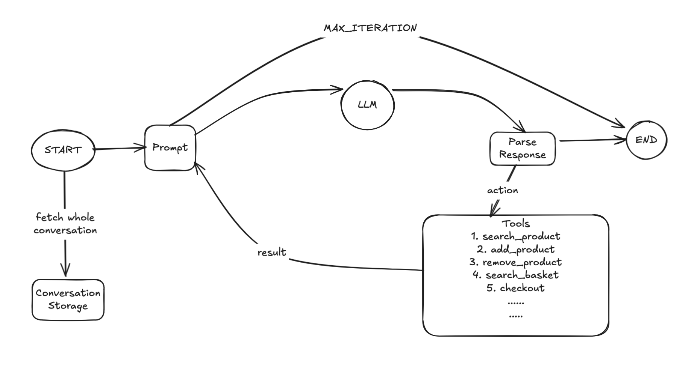

# Conversational Checkout System - Project Summary

## Overview

The Conversational Checkout System enables customers to shop through natural language interactions. The system uses OpenAI's API to interpret user intents and translate them into shopping actions, providing an intuitive shopping experience that handles product discovery, basket management, and order completion through conversation. The design balances conversational interaction with traditional UI components, using conversation for product discovery and basket management while employing structured UI elements for sensitive operations like payment processing and final order confirmation.

**Key Features:**
- Natural language product search and filtering
- Conversational basket management
- AI-powered intent recognition using OpenAI
- Support for up to 5,000 concurrent users
- React-based responsive UI

## Demo

[](https://www.youtube.com/watch?v=h4zQtGRQlc4)

## Assumptions
1. **Authentication not required**: The application uses persistent session-based basket management to provide a seamless shopping experience for unauthenticated user.
2. **Order Number format**: We need to provide a human readable order number to user. Currently we are using `ORD-YYYYMMDD-XXXXXXXX` format with 8 random characters to provide readability (~2.8 trillion combinations/day)
3. **Price Snapshot**: Product prices can change over time, requiring price snapshots in baskets. User should be able to checkout at the price they have added the item in basket.
4. **Conversation Management**: System doesn't need to provide explicit conversation management operations - list conversations, delete conversations
5. **Order Confirmation**: User shouldn't experience product out-of-stock after a successful payment for an order. Orders should expire after 15 minutes if not confirmed.
6. **Payment**: Payment processing is handled by external providers (Stripe, PayPal) via webhooks. One payment per order (either the order will get confirmed or succeed after one payment).
7. **Order details**: No need to handle shipping address, billing details
8. **LLM Context Window**: Context window is managable for now. No need to handle large context window issue.
9. **Intent Classification**: LLM based routing is acceptable for intent classification.
10. **LLM Guardrail**: No need to have guardrail or profanity check for input/output content.
11. **Caching**: We don't need caching for now to improve the overall latency
12. **UI**: No need to have separate product, basket or checkout pages. We don't need to show previous conversations for an user.


## High level design


## Architecture Approach

The system implements a **multi-agent architecture** with specialized AI agents coordinated through a router pattern. This approach provides modularity, maintainability, and clear separation of concerns while leveraging OpenAI's function calling capabilities for structured interactions.

### Core Architecture Components

#### 1. Agent Framework (Base Agent Class)



The foundation is a reusable `Agent` base class that provides:

- **OpenAI Integration**: Shared client instance with configurable model
- **Tool Execution Framework**: Tool registration and execution with error handling
- **Streaming Support**: OpenAI chat streaming for real-time response
- **Safety Mechanisms**: Max iteration limits (10) to prevent infinite loops
- **UI Context Processing**: Extracts and propagates UI rendering instructions from LLM

Key features:
- Tools are registered as Ruby procs with argument parsing
- Supports both blocking (`run`) and streaming (`run_stream`) execution modes
- Handles OpenAI function calling with automatic tool result injection
- Propagates context (session_id, conversation history) through tool executions

#### 2. Router Agent (Intent Classification)

The `RouterAgent` acts as the entry point and orchestrates the conversation flow:

**Responsibilities:**
- Classifies user intent based on recent conversations (last 10 messages) using LLM-based analysis
- Routes messages to appropriate specialized agents
- Provides fallback to chitchat agent for unclear intents

```
User Message → RouterAgent.classify_message() 
            → LLM analyzes intent + context
            → Routes to specialized agent
            → Streams response back to user
```

#### 3. Specialized Agents

**Product Search Agent:**
- Handles product discovery, filtering, and details based on conversation
- Tools: `search_products`, `get_product_details`, `render_ui`
- Integrates with `ProductSearchService` for product search and filtering
- Renders product lists and detail views via UI actions

**Cart Agent:**
- Manages shopping basket operations and order placement
- Tools: `view_basket`, `add_item_to_basket`, `remove_item_from_basket`, `update_basket_item`, `clear_basket`, `create_order`, `view_order`, `render_ui`
- Integrates with `BasketService` and `OrderService`
- Renders basket views, payment pages, and order confirmations via UI actions

**Chitchat Agent:**
- Handles general conversation, policies, and support
- Tools: `get_store_policy`, `get_store_hours`, `get_payment_methods`, `get_contact_info`
- Provides friendly, conversational responses
- Fallback for unclear or social interactions

#### 4. UI Rendering System

The architecture implements a **conversation based rendering approach** to provide a mix of traditional UI with conversation capabilites for a smooth User experience:

- Agent calls domain-specific tools (e.g., `search_products`, `add_item_to_basket`)
- Tools return structured data (JSON) with business logic results
- Agent calls `render_ui` tool as final action
- Specifies `action` (UI component to show) and `data_source` (which tool's data to use)
- System extracts UI context: `{ action: "show_product_list", data: {...}, tool_name: "search_products" }`
- UI context is sent to frontend via SSE `render_ui` event

Note: The data for each UI component is derived from the tool's data source and not infer from the AI model. This is to reduce hallucination chances. The AI just infer the UI action and the data source name. Also currently, structured output is not supported alongside tool calling in GPT models, so we have to rely on manual validation/parsing if we are infering the data from the model.

**Example Flow:**
```
User: "Show me red shirts"
→ ProductSearchAgent - search_products(query: "red shirts")
   Returns: { products: [...], count: 15 }
→ ProductSearchAgent - render_ui(action: "show_product_list", data_source: "search_products")
   Returns: { ui_action: "show_product_list", data_source: "search_products" }
→ AgentBase class processes ui_action, find data based on data_source and trigger a `render_ui` event
→ Frontend receives: { ui_context: { action: "show_product_list", data: {...} } }
→ React renders ProductList component with data
```

#### 5. Conversation Flow Architecture

**Request Flow:**
```
Frontend (React)
    ↓ POST /api/conversations/:id/messages (SSE)
ConversationsController
    ↓ Builds context from conversation history
RouterAgent
    ↓ Classifies intent
Specialized Agent (Product/Cart/Chitchat)
    ↓ Executes tools
    ↓ Calls render_ui
    ↓ Streams response chunks
ConversationsController
    ↓ Saves messages to conversation
    ↓ Sends UI context via SSE
Frontend
    ↓ Renders UI components
    ↓ Displays streamed text
```

**Streaming Events:**
- `content`: Text chunks as they're generated
- `tool_call`: When a tool is being executed
- `tool_result`: Result of tool execution
- `render_ui`: UI context for component rendering
- `done`: Conversation turn complete
- `error`: Error occurred

#### 6. Service Layer Integration

The agents don't handle business logic themselves—they pass that work off to dedicated service classes that know what they're doing.

The ProductSearchService handles everything related to finding products. It can do full text searches, filter by attributes, grab specific products by ID, and manage pagination through Pagy. We've also optimized it with PostgreSQL ts_vector and GIN indexes to keep searches fast.

BasketService takes care of the shopping basket and all it's realted operations. When someone adds an item, it checks inventory first to make sure we actually have it in stock, then captures the current price so customers aren't surprised by changes later.

OrderService is where orders gets created from basket and confirmed/cancelled. It creates orders within a transaction, deducts inventory (with automatic rollback if something goes wrong), generates unique order numbers, and clears out the basket once everything goes through successfully.


### Critical Features Deep Dive

#### Feature 1: Conversational Product Search

The product search feature enables natural language product discovery with intelligent filtering and context-aware recommendations.

**How It Works:**

1. **Natural Language Processing:**
   - User: "Show me red shirts under $50"
   - RouterAgent classifies intent as `product_search`
   - Routes to ProductSearchAgent

2. **Intent Extraction:**
   - ProductSearchAgent's system prompt guides OpenAI to extract structured parameters
   - Extracted: `{ query: "shirts", attributes: { color: "red" }, max_price: 50 }`

3. **Tool Execution - search_products:**
   ```ruby
   # Agent calls search_products tool
   {
     query: "shirts",
     attributes: { color: "red" },
     max_price: 50,
     limit: 20,
     page: 1
   }
   ```

4. **Service Layer Processing:**
   - `ProductSearchService` builds PostgreSQL query
   - Uses JSONB operators for attribute filtering: `attributes->>'color' = 'red'`
   - Applies price filter: `price <= 50`
   - Filters out-of-stock items: `inventory_quantity > 0`
   - Returns paginated results with Pagy
   - Tool returns structured product data (JSON)

5. **UI event:**
   - Agent calls `render_ui` tool:
     ```ruby
     {
       action: "show_product_list",
       data_source: "search_products"
     }
     ```
   - System extracts UI context from tool results

6. **Agent Resonse:**
   - Agent generate final response to be sent to user based on `search_product` result
   - Stream response in chunk via SSE `content` event
   - Streams related UI action via SSE `render_ui` event

7. **Frontend Display:**
   - React receives UI context with product data
   - Renders ProductList component
   - Shows product cards with images, prices, attributes
   - Displays "Add to Cart" buttons

#### Feature 2: Intelligent Checkout Flow

The checkout feature manages the complete purchase journey from basket management to order confirmation with robust inventory handling.

**Complete Checkout Journey:**

**Step 1: Adding Items to Basket**

User: "Add the first red shirt to my cart"

1. **Context-Aware Routing:**
   - RouterAgent analyzes conversation history
   - Sees previous product search results in context
   - Routes to CartAgent (not ProductSearchAgent)

2. **Product Resolution:**
   - Agent identifies "first red shirt" from conversation context
   - Extracts product_id from previous search results

3. **Tool Execution - add_item_to_basket:**
   ```ruby
   {
     product_id: 42,
     quantity: 1
   }
   ```

4. **Inventory Validation:**
   - `BasketService.add_item` checks product availability
   - Uses pessimistic locking: `Product.lock.find(42)`
   - Validates: `product.inventory_quantity >= requested_quantity`
   - Raises `InsufficientInventoryError` if insufficient

5. **Basket Update:**
   - Creates or updates `BasketItem` record
   - Captures `price_at_addition` (price snapshot)
   - Updates basket `last_activity_at` timestamp
   - Calculates new basket total

6. **UI Update:**
   - Agent calls `render_ui`:
     ```ruby
     {
       action: "show_basket",
       data_source: "add_item_to_basket"
     }
     ```
   - Frontend receives updated basket data
   - BasketSummary component re-renders
   - Shows: item added, new quantity, updated total

**Step 2: Basket Management**

User: "Show my basket" or "Remove item 2" or "Update quantity to 3"

- **view_basket:** Returns complete basket with all items and totals
- **remove_item_from_basket:** Removes item or decreases quantity
- **update_basket_item:** Changes quantity with inventory validation
- **clear_basket:** Empties entire basket

All operations trigger `render_ui(action: "show_basket")` for immediate UI feedback.

**Step 3: Order Creation**

User: "Checkout" or "Place my order"

1. **Order Initiation:**
   - Agent calls `create_order` tool
   - No parameters needed (uses session_id from context)

2. **Pre-Order Validation:**
   - `OrderService.create_from_basket` starts transaction
   - Validates basket is not empty
   - Checks inventory for ALL items (final validation)
   - Uses row-level locking to prevent race conditions

3. **Order Creation (Atomic Transaction):**
   ```ruby
   ActiveRecord::Base.transaction do
     # 1. Create order record
     order = Order.create!(
       order_number: generate_order_number(), # ORD-20251212-ABC12345
       session_id: session_id,
       total_amount: basket.total_price,
       status: 'pending'
     )
     
     # 2. Create order items
     basket.basket_items.each do |item|
       OrderItem.create!(
         order: order,
         product: item.product,
         quantity: item.quantity,
         price: item.price_at_addition,
         product_name: item.product.name
       )
     end
     
     # 3. Deduct inventory (with locking)
     basket.basket_items.each do |item|
       product = Product.lock.find(item.product_id)
       product.decrement_inventory!(item.quantity)
     end
     
     # 4. Clear basket (but keep basket record)
     basket.basket_items.destroy_all
   end
   ```

4. **Rollback on Failure:**
   - If ANY step fails, entire transaction rolls back
   - Inventory not deducted
   - Order not created
   - User receives clear error message

5. **UI Rendering - Payment Page:**
   - Agent calls `render_ui`:
     ```ruby
     {
       action: "show_order_payment",
       data_source: "create_order"
     }
     ```
   - **Critical:** This shows the payment page (not confirmation)
   - Order status is 'pending' until payment confirmed

6. **Frontend Payment Flow:**
   - React receives order data with payment instructions
   - Renders CheckoutPanel component
   - Shows order summary, total, payment form
   - User completes payment (Stripe/PayPal integration)
   - Payment webhook confirms order → status changes to 'confirmed'

**Step 4: Order Confirmation**

After payment success:

1. **Order Status Update:**
   - Payment webhook updates order status to 'confirmed'
   - Sends confirmation email (future enhancement)

2. **UI Rendering - Confirmation:**
   - Agent calls `render_ui`:
     ```ruby
     {
       action: "show_order_confirmation",
       data_source: "view_order"
     }
     ```
   - Shows order number, items, total, delivery estimate

**Concurrency Handling:**

The system handles multiple users purchasing the same product simultaneously:

```ruby
# User A and User B both try to buy last item

# User A's transaction
Product.lock.find(42) # Acquires row lock
product.inventory_quantity = 1
product.decrement_inventory!(1) # Success, inventory = 0
# Lock released

# User B's transaction (milliseconds later)
Product.lock.find(42) # Waits for lock
product.inventory_quantity = 0
product.decrement_inventory!(1) # Raises InsufficientInventoryError
# Transaction rolls back, order not created
```

**Error Scenarios:**

1. **Insufficient Inventory:**
   - Error: "Sorry, only 3 units available. Your basket has 5."
   - Suggests: "Would you like to update quantity to 3?"

2. **Product Not Found:**
   - Error: "Product not found"
   - Suggests: "Search for similar products?"

3. **Empty Basket Checkout:**
   - Error: "Cannot create order from empty basket"
   - Suggests: "Browse products to add items"

4. **Concurrent Purchase Conflict:**
   - Error: "Product became unavailable during checkout"
   - Suggests: "View similar products?"


### Architectural Decisions

#### 1. Multi Agent-Based Architecture

The system uses specialized AI agents for different domains:

- **RouterAgent**: Classifies user intent and routes to appropriate agent
- **ProductSearchAgent**: Handles product discovery and filtering
- **CartAgent**: Manages basket operations
- **ChitChatAgent**: Handles general conversation and questions

This separation of concerns allows each agent to be optimized for its specific domain while maintaining a cohesive conversational experience. Also, this architecture reduces hallucination by limiting each agent's decision space and makes the system more maintainable as we can test, monitor agents independently. The orchestrator adds some routing complexity, but it's worth the tradeoff for modularity. We could start by having some smaller ML model based routing to keep the latency of orchestrator layer minimal.

#### 2. Session-Based Basket Management

Baskets are tied to browser sessions using localStorage:

- **1:1 Relationship**: Each session has exactly one basket
- **Cross-Session Persistence**: Baskets survive browser restarts
- **Expiration**: Baskets expire after 90 days of complete inactivity

#### 3. JSONB for Product Attributes

Products use JSONB for flexible attribute storage:

- **Schema Flexibility**: Add new attributes without migrations
- **Efficient Querying**: GIN indexes enable fast JSONB queries
- **Rich Filtering**: Support for complex attribute combinations

Example attributes: color, size, category, material, brand, tags

#### 4. Checkout flow

1. **Checkout Initiation:** Reserve inventory with timeout
   - Start transaction
   - For each basket item, atomically check `inventory - reserved >= required`
   - Set `reserved += required` for each item
   - If any item fails, rollback transaction and show "item not available"
   - Create order with `pending_payment` status and `expires_at` timestamp
   - Commit transaction
   - Redirect to payment gateway

2. **Successful Payment Webhook:**
   - Record payment in payment table
   - Start transaction
   - For each order item, atomically deduct inventory and release reserved
   - Update order status to `complete`
   - Commit transaction

3. **Failed Payment Webhook:**
   - Record payment in payment table
   - Start transaction
   - For each order item, atomically release reserved
   - Update order status to `failed`
   - Commit transaction

4. **Expiration Handling:** (no payment action by user or no webhook call)
   - Option A: Cron job to check expired orders and release reserved items
   - Option B: Redis with TTL keys (orderId) and listen to expiry events
   - Must handle race conditions between reservation timeout and payment completion

**Alternative Approach (For Small Scale):**

For a small-scale e-commerce platform with good inventory levels and low traffic, we can use a straightforward checkout flow without reserving inventory and avoid handling of complexities and edge cases that comes with it. This is a pragmatic tradeoff between business requirements and technical complexity.

1. User proceeds to checkout with items in basket
2. Validates items are still in stock
3. Create order with items
3. Redirect to payment gateway
4. After successful payment:
   - Record payment
   - Deduct inventory atomically
   - Update order status to complete
5. If inventory insufficient after payment:
   - Handle as edge case (refund scenario)

- Low traffic and good inventory make out-of-stock after payment scenarios rare


#### 5. Conversation vs Traditional UI Balance

#### Conversational Components

**Product Discovery:**
- Natural language search ("show me red shirts under $50")
- Conversational filtering and refinement
- Clarification questions for ambiguous requests

**Basket Management:**
- Conversational add/remove/update ("add 2 blue shirts")
- Basket inquiry through chat ("what's in my basket?")
- Clarification questions for ambiguous requests

**Order Management:**
- Checkout **initiation** ("place order for 2 shirts")
- Order inquiry ("what's my order number?", "what's the order status?")
- Order cancellation ("cancel my order")

#### Traditional UI Components

**Sensitive Operations:**
- Payment details
- Payment confirmation

**Visual Displays:**
- Product cards with images and details
- Basket summary sidebar
- Order confirmation screens
- Quantity controls and buttons

**Quick Actions:**
- "Add to Basket" buttons on product cards
- Quantity increment/decrement controls
- Remove item buttons

#### Rationale

This hybrid approach provides:
- **Convenience**: Natural language for discovery and exploration while visual displays provide immediate context
- **Trust**: Users can see exactly what they're buying with product images and details
- **Security**: Explicit UI for sensitive data
- **Efficiency**: Quick actions via buttons for common operations without typing
- **Flexibility**: Choose between conversation or clicking based on preference and context 
- **Clarity**: Visual confirmation of actions


## Conclusion

The Conversational Checkout System successfully demonstrates the potential of AI-powered shopping experiences. By combining natural language processing with traditional e-commerce functionality, the system provides an intuitive and engaging way for customers to discover and purchase products.

## Local Development Setup

#### Prerequisites:

##### General Software Requirements

- Install the latest [Node.js](https://nodejs.org) version. Make sure that [npm](https://www.npmjs.com/) is installed with it as well.
- Install [yarn](https://yarnpkg.com/en/docs/install)
- Install [Ruby version 3.3.6](https://www.ruby-lang.org/en/news/2023/12/25/ruby-3-3-0-released/)
- Install [Postgres](https://postgresapp.com)

##### Installation steps on macOS

- Install [Homebrew](https://brew.sh).
- Install the latest [Node.js](https://nodejs.org) version. Make sure that [npm](https://www.npmjs.com/) is installed with it as well.
- Install [RVM](https://rvm.io/rvm/install)
- Install Ruby 3.3.6 using RVM

  ```
  rvm install 3.3.6
  ```

  To make 3.3.6 as default and current version execute

  ```
  rvm --default use 3.3.6
  ```

- Install PostgreSQL using Homebrew.

  ```
  brew install postgresql
  ```

  Once postgresql is installed to start the server daemon run

  ```
  brew services start postgresql
  ```

- Install Yarn
  ```
  brew install yarn
  ```

#### Bundle Install and Setup DB

```
bundle install
bundle exec rake setup
```

#### Execute yarn

```
bin/yarn
```

#### Spinning up the App

```
./bin/dev
```

Then visit http://localhost:3000
